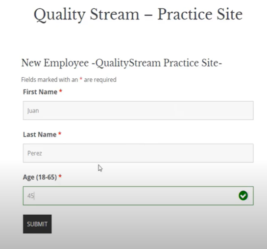

# Ejercicio 1: Tablas de decisión para validación de préstamos hipotecarios

## 1.1 Tabla de decisión

Tenemos una empresa que otorga préstamos hipotecarios para personas cuyos sueldos oscilan entre los 1000 y 83000 pesos por mes; si gana menos de 1000 pesos no califica, si gana mas e 83000 pesos no necesita prestamos.

Además la empresa solo otorga prestamos a personas, no así a las corporaciones, sociedades o cualquier otra entidad legal.

Por otra parte, solo se otorgan préstamos para adquirir condominios, casas de campo o casa de familia. No se realizará préstamos para la adquisición de dúplex, casa rodantes o cualquier otro tipo de propiedad.

### Resolución

| Sueldo (ARS) | Es Persona Física | Tipo de Propiedad      | ¿Califica para Préstamo? |
|--------------|-------------------|-------------------------|-------------------------|
| 950          | Sí                | Casa de familia         | ❌                      |
| 1500         | Sí                | Casa de campo           | ✅                      |
| 85000        | Sí                | Condominio              | ❌ (excede límite)      |
| 3000         | No                | Condominio              | ❌ (no es persona)      |
| 5000         | Sí                | Casa rodante            | ❌ (propiedad inválida) |
| 5000         | Sí                | Dúplex                  | ❌ (propiedad inválida) |

## 1.2 Tabla de equivalencia (útil para entradas/salidas esperadas)

| Entrada                                  | Salida esperada          |
|------------------------------------------|--------------------------|
| Sueldo = 2000, propiedad = casa de campo | ✅ Préstamo aprobado     |
| Sueldo = 500, propiedad = condominio     | ❌ Sueldo insuficiente   |
| Sueldo = 90000, propiedad = condominio   | ❌ Sueldo demasiado alto |
| Sueldo = 5000, tipo = sociedad anónima   | ❌ No es persona física  |

## 1.3 Tabla de particiones de equivalencia (para cubrir rangos válidos e inválidos)

| Rango de sueldo | Partición        | Resultado esperado        |
|------------------|------------------|--------------------------|
| < 1000           | Inválida         | ❌ Rechazo               |
| 1000 - 83000     | Válida           | ✅                       |
| > 83000          | Inválida         | ❌ Rechazo               |

## 1.4 Tabla de combinaciones (para cubrir casos multidimensionales)

| Sueldo válido | Persona Física | Propiedad válida | Resultado |
|---------------|----------------|------------------|-----------|
| Sí            | Sí             | Sí               | ✅        |
| Sí            | Sí             | No               | ❌        |
| Sí            | No             | Sí               | ❌        |
| No            | Sí             | Sí               | ❌        |
| No            | No             | No               | ❌        |

# Ejercicio 2: Tabla de validación de edades

| Caso de prueba | Edad ingresada | Descripción                          | Resultado esperado     |
|----------------|----------------|--------------------------------------|------------------------|
| 1              | 17             | Menor que el mínimo permitido        | ❌  (mensaje de error) |
| 2              | 18             | Límite inferior válido               | ✅                     |
| 3              | 45             | Valor dentro del rango válido        | ✅                     |
| 4              | 65             | Límite superior válido               | ✅ 		              |
| 5              | 66             | Mayor que el máximo permitido        | ❌  (mensaje de error) |
| 6              | "veinte"       | Texto en lugar de número             | ❌  (formato inválido) |
| 7              |                | Campo vacío                          | ❌  (campo requerido)  |
| 8              | -5             | Número negativo                      | ❌  (fuera de rango)   |
| 9              | 18.5           | Número decimal                       | ❌  (sólo enteros)     |

# Ejercicio 3: Ejercicio de examen ISTQB

Se debe calcular la bonificación de un empleado. No puede ser negativa, per puede reducir a cero. La bonificación se basa en la duración del empleo:
- Menos de o igual a 2 años
- Más de 2 años pero menos de 5 años
- 5 a 10 años inclusive o más de 10 años
¿Cuál es el número mínimo de casos de pruebas necesario para cubrir todas las particiones de equivalencia válidas para calcular la bonificación?
- A) 3
- B) 5
- C) 2
- D) 4

## Respuesta: A.

Tres casos de prueba son suficientes para cubrir todas las particiones válidas.

# Ejercicio 4: Aplicación de entrenamiento físico

Una aplicación de entrenamiento fisico mide el número de pasos que se caminan cada dia y proporciona informacion para animar al usuario a mantenerse en forma.

La retroalimentación para las diferentes cantidades de pasos debe ser:

- Hasta 1000 pasos - ¡Lleva una vida sedentaria!
- Más de 1000 pasos, hasta 2000 - ¡Lleva una vida poco activa!
- Más de 2000 pasos, hasta 4000- ¡Se acerca al objetivo!
- Más de 4000 pasos, hasta 6000 -¡No está mal!
- Más de 6000 pasos -¡Así se hace!
¿Cuál de los siguientes conjuntos de entradas de pruebas lograria la cobertura de particion de equivalencia más alta?
- A)  (0,  1000,  2000,  3000,  4000)
- B)  (1000,  2001,  4000,  4001,  6000)
- C)  (123,  2345,  3456,  4567,  5678)
- D)  (666,  999,  2222,  5555,  6666)

## Respuesta: D.

Es el único conjunto que cubre 4 de las 5 particiones, incluida la más alta (> 6000), lo que le da la cobertura más amplia en términos de particiones.

