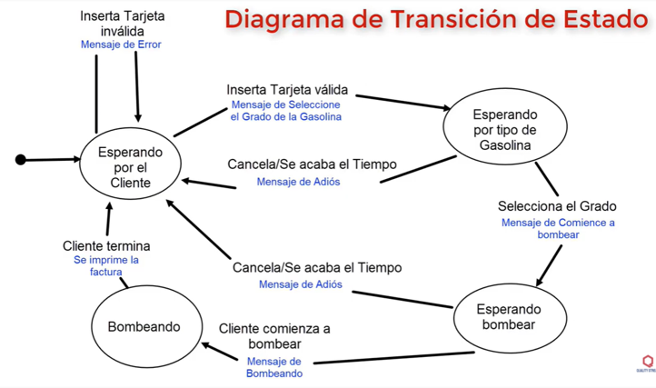

  <a href="./../README.md" style="text-decoration:none; background:#eee; border:1px solid #ccc; padding:4px 8px; border-radius:4px; font-size:90%;">Volver al README</a>

# Ejercicio 1: Sistema de administración de bugs

**Enunciado:**
Aplicar la técnica de transición de estado a un sistema de administración de bugs.

**Estados posibles:**

* Abierto
* Asignado
* Rechazado
* Solucionado
* Reabierto
* Cerrado
* Postergado

### Transiciones típicas posibles:

| Estado actual | Evento / Acción      | Estado siguiente |
| ------------- | -------------------- | ---------------- |
| Abierto       | Asignar responsable  | Asignado         |
| Abierto       | Rechazar             | Rechazado        |
| Asignado      | Resolver             | Solucionado      |
| Solucionado   | Verificación fallida | Reabierto        |
| Solucionado   | Verificación exitosa | Cerrado          |
| Reabierto     | Asignar nuevamente   | Asignado         |
| Asignado      | Postergar            | Postergado       |
| Postergado    | Reanudar             | Asignado         |
| Rechazado     | Reabrir              | Reabierto        |

Para cubrir completamente cada transición al menos una vez ("**cobertura de transiciones**"), se requiere al menos una prueba por transición identificada en la tabla.

---

# Ejercicio 2: Diagrama de transición para bomba de gasolina

**Enunciado:**
Considere el siguiente diagrama de transición de estado para una bomba de gasolina que utiliza tarjeta de crédito (ver imagen).

Se desea desarrollar el **número mínimo de pruebas** para cubrir **cada transición** del sistema al menos una vez. Cada prueba **comienza en el estado inicial** "Esperando por el Cliente" y termina al **volver a ese estado**.

### Transiciones del sistema:

1. Inserta tarjeta inválida → mensaje de error (no cambia de estado)
2. Inserta tarjeta válida → va a *Esperando por tipo de gasolina*
3. Cancela / se acaba el tiempo en *Esperando tipo gasolina* → vuelve a inicio
4. Selecciona el grado → va a *Esperando bombear*
5. Cancela / se acaba el tiempo en *Esperando bombear* → vuelve a inicio
6. Cliente comienza a bombear → va a *Bombeando*
7. Cliente termina → se imprime factura y vuelve a inicio

### Estrategia de pruebas para cubrir todas las transiciones:

**Prueba 1:**

* Estado inicial: Esperando por el cliente
* Inserta tarjeta inválida → mensaje de error (se mantiene)

**Prueba 2:**

* Inserta tarjeta válida → Esperando por tipo de gasolina
* Cancelar / tiempo expira → regreso a inicio

**Prueba 3:**

* Inserta tarjeta válida → Esperando por tipo de gasolina
* Selecciona grado → Esperando bombear
* Cancelar / tiempo expira → regreso a inicio

**Prueba 4:**

* Inserta tarjeta válida → Esperando por tipo de gasolina
* Selecciona grado → Esperando bombear
* Comienza a bombear → Bombeando
* Cliente termina → se imprime factura → regreso a inicio

### Total de pruebas necesarias: **4**

  <a href="./../README.md" style="text-decoration:none; background:#eee; border:1px solid #ccc; padding:4px 8px; border-radius:4px; font-size:90%;">Volver al README</a>

